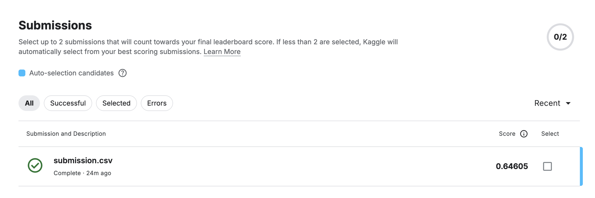

# COVID-19 CT Images Segmentation

A [U-Net](https://arxiv.org/abs/1505.04597) trained from scratch in PyTorch to
segment chest-CT slices into four classes: Ground Glass, Consolidation, Lungs
and Background. Kaggle competition
[covid-segmentation](https://www.kaggle.com/competitions/covid-segmentation),
which scores the two lesion classes.

The architecture is the encoder-decoder with skip connections from Ronneberger,
Fischer & Brox, *U-Net: Convolutional Networks for Biomedical Image
Segmentation*, MICCAI 2015 ([arXiv:1505.04597](https://arxiv.org/abs/1505.04597)):
four encoder levels plus a bottleneck (64 → 1024 channels), concatenating skip
connections at every level, and a final 1×1 convolution to the 4 class logits.
31,042,564 parameters.

**Team:** Dongju Mun · Carlos Manuel Martínez · Juan Sebastián Chitiva Guerrero ·
Evan André Santana Pacheco · Jorge Manuel Oyoqui Aguilera

## Result

**Kaggle score 0.64605** — 15 epochs, batch size 8, RTX 5060 (CUDA).

The poster describes an earlier run of the same model: 30 epochs at batch 16 on
a Colab Tesla T4, whose best checkpoint was epoch 15 (validation Dice 0.5469 for
the two lesion classes). That is why this run trains for 15 epochs. Batch size
dropped to 8 because on an 8 GB laptop card batch 16 spills to system RAM
instead of raising an out-of-memory error, making each epoch about four times
slower.

## Run

Place the five `.npy` files in `data/`, then:

```bash
python3 -m venv .venv
./.venv/bin/pip install torch numpy pandas albumentations opencv-python-headless tqdm

./.venv/bin/python run.py --epochs 15 --batch-size 8   # train + write submission.csv
./.venv/bin/python run.py --predict-only               # rebuild submission from best.pt
```

Device is chosen automatically (CUDA → MPS → CPU); mixed precision runs on CUDA only.

## Layout

```
COVID_19_CT_Images_Segmentation.ipynb   full analysis: EDA, cleaning, figures, training
run.py                                  same pipeline as a script
poster/                                 project poster
```

## Feedback

We did not make the first submission, so we received no feedback to act on.

## Kaggle participation

Notebook on Kaggle:
<https://www.kaggle.com/code/csvzqzz/ct19-segmentation-tc3009>


